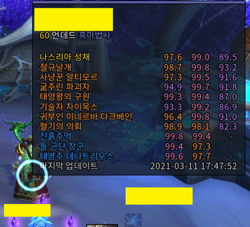
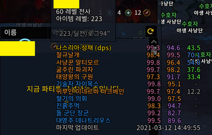
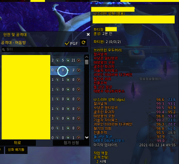

# WoWcl

WowCl 은 인게임에서 쉽게 WarcraftLogs 의 점수를 조회할 수 있도록 도와주는 애드온입니다.

사용 전 반드시 본 메뉴얼을 숙지하여 주십시오.

이 애드온은 [Affero General Public License v3](/LICENSE) 하에 배포됩니다

## 주의사항

- WoWcl의 모든 사용자는 아래 항목을 준수해야 하며, 애드온 개발 기여자들은 그 어떤 피해도 책임지지 않습니다.

    - 본 애드온의 변경이나 악용을 기반으로 하는 모든 악의적인 행위
    - 본 애드온 개발에 기여를 한 사람들 또는 타인의 명예나 신용을 훼손 또는 비방, 중상 또는 협박과 같은 행위
    - 기타 법률, 법령 혹은 조례를 위반 또는 그럴 우려가 있는 모든 행위

- 본 애드온은 월드 오브 워크래프트 **한국 서버의 호드 만 집계**됩니다.

- 로그 점수는 특수 임무 혹은 공략 방법, 공략 불이행 정도에 따라 많은 차이가 날 수 있습니다.

- 따라서 **로그 점수는 개개인의 공략 이해, 숙련 또는 숙련도를 판단하는 척도가 되지 못합니다.**

- WoWcl 은 매주 **목, 금, 토, 일요일**에 로그 정보를 가져오고, 정보를 가져오는 대로 애드온 업데이트에 반영됩니다.

- **본 애드온의 업데이트는 예고 없이 중단될 수 있습니다.**

## 스크린샷

## 사용 방법

- 대상 캐릭터나 레이드 프레임에 마우스를 가져다가 댑니다.

- 파티찾기 창 및 파티참가 수락/거절 에서도 사용할 수 있습니다

- 왼쪽에는 보스의 이름을, 오른쪽에는 일반 / 영웅 / 신화 점수를 순서대로 표시합니다.

- 필드에서는 딜러 로그를 기본으로 표시합니다.

- 레이드 프레임 및 파티 참가 수락/거절 창에서는 해당 역할을 기본으로 표시합니다.

- 아래 키를 눌러 탱(dps), 힐(hps), 딜(dps) 로그를 확인할 수 있습니다.
    |단축키|설명|
    |:-:|:-:|
    |`Shift`|탱커 dps 로그|
    |`Control`|힐러 hps 로그|
    |`Alt`|딜러 dps 로그|

- 보스 이름의 색상 배정은 아래와 같습니다.
    |최대 클리어|색|
    |:-:|:-:|
    |신화|노란색|
    |영웅|분홍색|
    |일반|초록색|
    |기록 없음|회색|

- 로그 점수 색 배정은 아래와 같습니다. (WarcraftLogs 와 동일하지만 조금 더 밝음)
    |범위|색|
    |:-:|-|
    |`100`|노란색|
    |`99`|주황색|
    |`95 - 99`|분홍색|
    |`75 - 95`|보라색|
    |`50 - 75`|파란색|
    |`25 - 50`|초록색|
    |`0 - 25`|회색|

## 설치방법

### wowup

1. [WoWup](//wowup.io) 을 설치합니다

2. **애드온 찾기** 탭으로 이동합니다

3. URL 주소로 설치를 클릭합니다

4. 빈 칸에 `https://github.com/RyuaNerin/WoWcl` 를 입력합니다.
