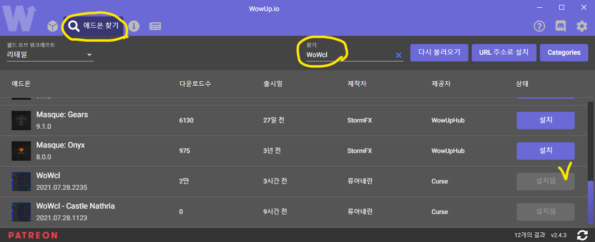

- 목차
	- [WoWcl](WoWcl)
	- [주의사항](#주의사항)
	- [사용 방법](#사용-방법)
	- [설치방법](#설치방법)
		- [WowUp](#WowUp)
		- [CurseForge](#CurseForge)
	- [문의](#문의)

[인벤 게시글](https://www.inven.co.kr/board/wow/17/37268)

# WoWcl

WowCl 은 인게임에서 쉽게 WarcraftLogs 의 점수를 조회할 수 있도록 도와주는 애드온입니다.

- 사용 전 반드시 본 메뉴얼을 숙지하여 주십시오.

- 이 애드온은 [Affero General Public License v3](LICENSE) 하에 배포됩니다

- 제작 : 류아네린 (RyuaNerin, RyuaRin)

## 주의사항

- WoWcl의 **모든 사용자는 아래 항목을 준수**해야 하며, 애드온 개발 기여자들은 그 어떤 피해도 책임지지 않습니다.

	- 본 애드온의 변경이나 악용을 기반으로 하는 모든 악의적인 행위
	- 본 애드온 개발에 기여를 한 사람들 또는 타인의 명예나 신용을 훼손 또는 비방, 중상 또는 협박과 같은 행위
	- 기타 법률, 법령 혹은 조례를 위반 또는 그럴 우려가 있는 모든 행위

- 본 애드온은 **월드 오브 워크래프트 한국 서버만 집계**됩니다.
- 로그 점수는 특수 임무 혹은 공략 방법, 공략 불이행 정도에 따라 많은 차이가 날 수 있습니다.
- 따라서 **로그 점수는 개개인의 공략 이해, 숙련, 수행도를 판단하는 척도가 되지 못합니다.**
- WoWcl 은 매일 12시부터 갱신을 시작해 약 7~8시 사이에 애드온에 반영됩니다.
- 본 애드온의 **업데이트는 예고 없이 중단될 수 있습니다.**

## 사용 방법

- 아래의 상황에서 사용하실 수 있습니다.
	- **캐릭터**에 마우스 올리기
	- **레이드 프레임** 캐릭터 이름에 마우스 올리기
	- **파티찾기 창**에서 마우스를 올려 파티장의 로그 보기
	- **파티참가 수락/거절 창**에서 캐릭터에 마우스를 올려 신청자의 로그 보기
	
- 왼쪽에는 보스의 이름을, 오른쪽에는 **일반 / 영웅 / 신화 점수를 순서대로 표시**합니다.

- 보스 이름은 일반/영웅/신화 클리어 여부에 따라 색이 바뀌게 됩니다.

    |최대 클리어|색|
    |:-:|:-:|
    |신화|노란색|
    |영웅|분홍색|
    |일반|초록색|
    |기록 없음|회색|
	
- 너무 많은 공간 차지를 방지하기 위해 각 역할군의 평균 점수만 표시합니다.

	- 네임드 별 로그를 보고싶으시면 `Shift`, `Control`, `Alt` 를 활용해주세요.

		|단축키|설명|
		|:-:|:-:|
		|`Shift`|보스별 탱커 dps 로그|
		|`Control`|보스별 힐러 hps 로그|
		|`Alt`|보스별 딜러 dps 로그|
		|`Shift + Control + Alt`|최고 성적 역할군의 세부 로그|

- 로그 점수 색은 **WarcraftLogs 에서 사용되는 색과 동일**합니다

    |범위|색|
    |:-:|-|
    |`100`|노란색|
    |`99`|주황색|
    |`95 - 99`|분홍색|
    |`75 - 95`|보라색|
    |`50 - 75`|파란색|
    |`25 - 50`|초록색|
    |`0 - 25`|회색|

## 설치방법

- 나스리아 성채 데이터를 보고싶으신 경우 **[WoWcl - Castle Nathria](https://www.curseforge.com/wow/addons/wowcl-castle-nathria) 를 추가로 설치**해주세요.

- 설치하지 않으면 지배의 성소 로그만 표시됩니다.

### WowUp

1. [WowUp](//wowup.io) 을 설치합니다

1. **애드온 찾기** 탭으로 이동합니다

1. `WoWcl` 을 검색하여 다운로드 할 수 있습니다.

- **업데이트가 매일 진행되므로 자동 업데이트를 켜주세요**

	1. **내 애드온** 탭으로 이동합니다

	1. `WoWcl` 우클릭

	1. `자동 업데이트` 체크

	

### CurseForge

- [**여기**](https://curseforge.overwolf.com/?addonId=461531)를 눌러 CurseForge 를 실행하여 애드온을 설치할 수 있습니다.

- 혹은 `WoWcl` 을 검색하여 설치할 수 있습니다.

- 나스리아 성채 데이터가 필요하신 경우 [**여기**](https://curseforge.overwolf.com/?addonId=508680)를 눌러 `WoWcl - Castle Nathria` 를 설치해주세요

## 문의

- 트위터 : [@RyuaNerin](https://twitter.com/RyuaNerin)
- 이메일 : [contact@ryuar.in](mailto:admin@ryuar.in) / [ryuanerin@gmail.com](mailto:ryuanerin@gmail.com)
- 와우 : 경력직자택경비원@아즈샤라
